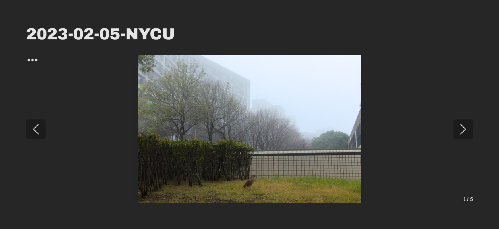
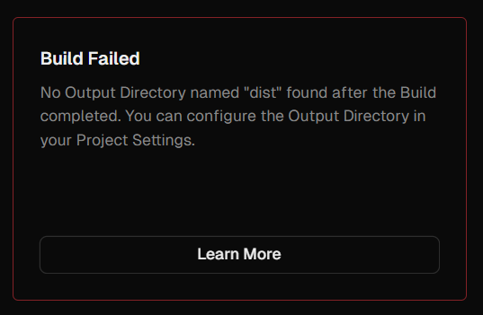
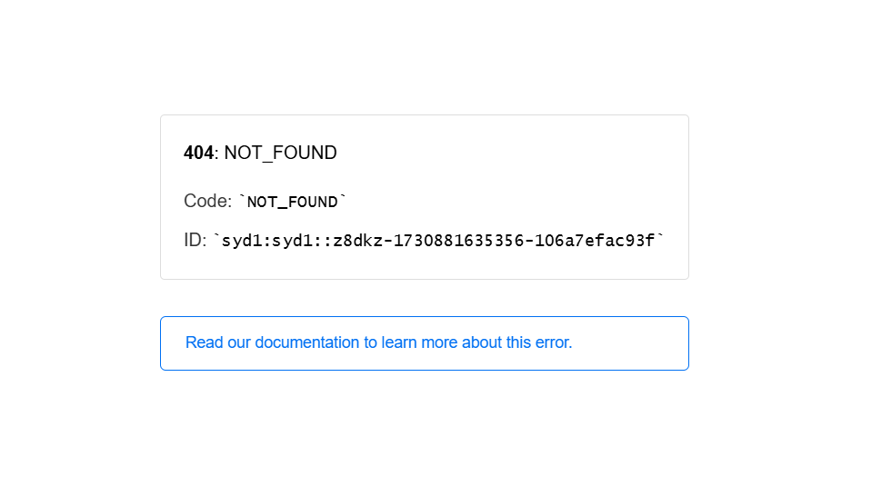
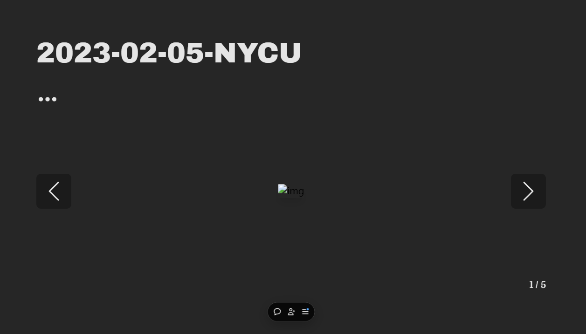

# Nuxt-photo-slideshow



This project is a **photo slideshow website** built using **Nuxt 2**, bringing together the skills I've learned over time.

<br />

## Key Skills and Tools:

- **Photography**: Featuring photos captured and edited by me.
- **Graphic Design**: Applied fundament design principles for a clean layout.
- **[Vue.js](https://vuejs.org/)**: Used for modern front-end development.
- **[Nuxt 2](https://v2.nuxt.com/)**: A Vue framework for static site generation.
- **[Vercel](https://vercel.com/)**: An easy way to host static websites.

<br />

Additional useful tools:
- **[Tailwind CSS](https://tailwindcss.com/)**: Write more concise CSS code.
- **[Flicking](https://naver.github.io/egjs-flicking/)**: So that I don't have to implement the sliding effect.
- **[Nuxt Image (for Nuxt 2)](https://v0.image.nuxtjs.org/)**: Optimizes image rendering.
- **[Nuxt Vercel Builder](https://github.com/nuxt/vercel-builder/tree/main)**: Helps Vercel build a Nuxt 2 project.

<br />

## Issues Encountered

During the initial deployment on Vercel, I encountered multiple errors.

### 1. Failed Bulid / 404 Not Found

Sometimes the build would fail with an error message saying the output directory is wrong.



Some people suggested [overriding the Output Directory in Vercel's Project Settings](https://stackoverflow.com/questions/75592472/no-output-directory-named-build-found-after-the-build-completed-you-can-confi). This solution did fix the issue and the deployment could be run successfully. However, after the delopyment finished, the website showed "404 Not Found".



My final working solution was to add a  `vercel.json` file in the root directory of the project:
```
{
    "version": 2,
    "builds": [
        {
            "src": "nuxt.config.js",
            "use": "@nuxtjs/vercel-builder"
        }
    ]
}
```
For more details, see [Nuxt Vercel Builder](https://github.com/nuxt/vercel-builder/tree/main).

<br />

### 2. Images Not Showing

Another issue occurred where images failed to display properly.



To fix the issue, I added the following in `nuxt.config.js`:
```
image: {
    provider: 'static'
},
```
While this should be the default setting, it somehow fixed the issue.
